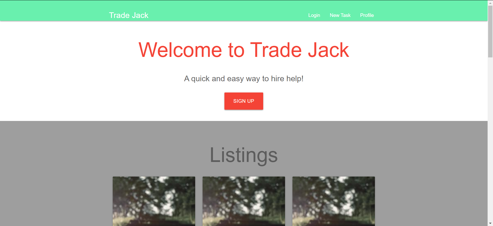

# TradeJack

## Description
This is Reverse task bidding application where users can post tasks or projects they need help with and other users can bid on those tasks. 

## Technologies Used
 ### Front:
 HTML, CSS, CSS Library: Materialize, JavaScript
 ### Back:
 MySQL, Heroku, JawsDB, Node, 
 NPM packages: Express, Handlebars, and Sequelize 

## Deployed Link
https://trade-jack.herokuapp.com/

## Deployment

### Requirements 
  - Github 
  - mySQL workbench
  - Heroku 
  - JawsDB Heroku add-on

### Directions
  - Clone this repository:
    - Open Command Line Interface (CLI) and navigate to the folder you want to clone this repository into.
    - CLI Command: "git clone https://github.com/jittel/project2"
    - CLI Command: "npm install"
  
  Localhost setup:
  - MODIFY FILE ./config/config.json on line 4 if your mySQL workbench password is not "password"
  - mySQL local database setup:
   - Copy/paste content of db/schema.sql into mySQL workbench and run then
   - OPTIONAL: 
  - CLI Command: "node server.js"
  - In browser go to: http://localhost:8080
  
  Heroku deployment:
  - Create a new Heroku app by following the directions at: https://devcenter.heroku.com/articles/creating-apps
  - Open your new Heroku app by loging into your account or, if you setup the project through your CLI, by following the link provided (example: https://git.heroku.com/example.git)
  - Click on "Configure Add-ons" and search for "JawsDB MySQL"
  - Setup JawsDB by following the documentation at: https://devcenter.heroku.com/articles/jawsdb
  - Files to modify:
    - ADD a file named ".env" at the root level
      - COPY your jawsDB URL into that file set to the variable which should look like the example below:
        - JAWSDB_URL = "mysql://(your link here found on the JawsDB project page)"
  - Create a new database in MySQL to connect to JawsDB
    - In MySQL navigate to the home page by clicking on the home icon in the top left of the workbench
    - Click the wrench icon to the right of "MySQL Connections" heading
    - Use the JawsDB connection settings on this page, no other setting should need to be changed from default if they are not listed here. (below: "MySQL Setting" = "JawsDB Setting")
      - "Connection Name" = "Database"
      - "Hostname" = "Host"
      - "Port" = "Port"
      - "Username" = "Username"
      - "Password" click "Store in Vault..." = "Password"
  - Push your changes to Github
  - CLI comand: "git push heroku master"
  - Open your Heroku deployed link

